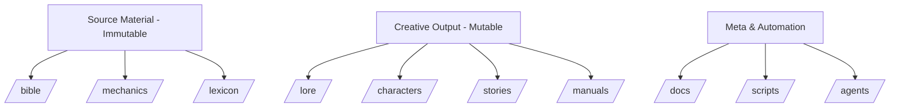

# Structural Audit & Optimization Plan for The Forgotten Tides Universe Repository

## 1. Structural Audit & Taxonomy Analysis

### Current Structure Issues

**1.1. Dangerous Data Duplication Between Lore and Bible**
- **Problem**: The current distinction between `lore/` (myth/history) and `bible/` (canonical facts) creates potential for dangerous duplication and inconsistency.
- **Evidence**: The `bible/ARCHIVISTS_WAKE_STORY_BIBLE.md` contains canonical character definitions that could conflict with lore files.
- **Risk**: AI agents querying for character details might get conflicting information from different sources.

**1.2. Lexicon as Standalone vs Structured Data**
- **Problem**: The `lexicon/GLOSSARY.md` is currently a standalone markdown file, making programmatic access difficult for RAG systems.
- **Evidence**: Terms are organized alphabetically but lack unique identifiers or structured metadata.
- **Risk**: Cross-referencing terms in stories becomes manual and error-prone.

**1.3. Inconsistent File Organization**
- **Problem**: Some directories mentioned in README.md don't exist in the current structure (`/factions`, `/atlas`, `/design`).
- **Evidence**: README.md lists future directories that aren't implemented yet.
- **Risk**: Creates confusion about where new content should be placed.

### Proposed Hierarchy



**Key Improvements:**
1. **Source Material (Immutable Facts)**:
   - `/bible/` - Canonical story bibles and immutable facts
   - `/mechanics/` - Physics rules and hard magic systems
   - `/lexicon/` - Structured glossary with unique IDs

2. **Creative Output (Mutable Drafts)**:
   - `/lore/` - Historical events, myths, timelines
   - `/characters/` - Character profiles with YAML frontmatter
   - `/stories/` - Completed fiction
   - `/manuals/` - In-universe technical documents

3. **Meta & Automation**:
   - `/docs/` - Contribution guidelines, style guides
   - `/scripts/` - Automation and validation tools
   - `/agents/` - AI agent prompts

## 2. File Format & Metadata Standards

### Recommended YAML Frontmatter Schema

```yaml
---
canonical_id: "char_1192-R"  # Unique identifier
type: "character"            # or "location", "event", etc.
name: "Rell"
aliases: ["Pilot-Technician", "The Hollow One"]
universe: "The Forgotten Tides"
status: "canonical"          # canonical, speculative, deprecated
created: "2025-12-11"
modified: "2025-12-11"
tags:
  - "pilot"
  - "memory-corridor"
  - "anchor-burn"
  - "canticle-fleet"
references:
  characters: ["char_1193-S", "char_1194-E", "char_1195-T"]  # Sutira, Estavan, Tari
  locations: ["loc_401-H"]    # Heliodrome
  events: ["event_201-LG"]    # Lattice Gap incident
  mechanics: ["mech_301-MD"]  # Memory Drive mechanics
---

# Rell
Pilot-Technician, Canticle Fleet
```

**Key Features:**
- `canonical_id`: Unique UUID-style identifier for disambiguation
- `references`: Cross-reference IDs for tracing relationships
- `status`: Clear indication of canon level
- `tags`: Semantic categorization for RAG retrieval

### Lexicon Structure Recommendation

Convert `lexicon/GLOSSARY.md` to structured format:

```yaml
# lexicon/terms.yaml
terms:
  - id: "term_001"
    term: "Anchor"
    definition: "A memory or mental construct used by pilots to maintain selfhood under corridor stress."
    category: "memory-technology"
    related_terms: ["anchor-burn", "anchor-knot", "zero-anchoring"]
    canonical_source: "bible/ARCHIVISTS_WAKE_STORY_BIBLE.md"
    first_appearance: "The Archivist's Wake"

  - id: "term_002"
    term: "Memory Corridor"
    definition: "A spacetime pathway stabilized by memory for FTL traversal."
    category: "ftl-technology"
    related_terms: ["corridor-thinning", "memory-drive", "eddy"]
    # ... etc
```

## 3. Agents & Scripts Review

### Current Automation Assessment

**Existing Scripts:**
- `check_canon.sh`: Basic smoke tests for canonical rules
- `validate_links.sh`: Link validation using lychee

**Missing Automation Opportunities:**
1. **Glossary Linter**: Check if capitalized terms in stories exist in lexicon
2. **Canonical Reference Validator**: Ensure character/location references are valid
3. **YAML Frontmatter Validator**: Validate schema compliance
4. **Cross-Reference Builder**: Auto-generate reference maps

### Recommended Python Scripts

```python
# scripts/glossary_linter.py
import re
import yaml
import glob
from pathlib import Path

def load_lexicon():
    """Load structured lexicon data"""
    with open('lexicon/terms.yaml', 'r') as f:
        return yaml.safe_load(f)

def check_story_terms(story_path, lexicon):
    """Check if all capitalized terms exist in lexicon"""
    with open(story_path, 'r') as f:
        content = f.read()

    # Find capitalized terms (simplified regex)
    capitalized_terms = re.findall(r'\b[A-Z][a-zA-Z]+(?: [A-Z][a-zA-Z]+)*\b', content)

    # Filter out common words and check against lexicon
    lexicon_terms = {term['term'].lower() for term in lexicon['terms']}
    issues = []

    for term in capitalized_terms:
        if term.lower() not in lexicon_terms and term not in ['The', 'And', 'But', 'Or']:
            issues.append(f"Term '{term}' not found in lexicon")

    return issues

# scripts/canonical_validator.py
import yaml
import frontmatter
from pathlib import Path

def validate_references(file_path):
    """Validate that all referenced IDs exist in the knowledge base"""
    post = frontmatter.load(file_path)
    metadata = post.metadata

    # Load all canonical IDs from the knowledge base
    # This would be implemented with actual file scanning
    all_characters = load_all_character_ids()
    all_locations = load_all_location_ids()

    issues = []

    for ref_type, ref_ids in metadata.get('references', {}).items():
        if ref_type == 'characters':
            for char_id in ref_ids:
                if char_id not in all_characters:
                    issues.append(f"Character reference '{char_id}' not found")
        elif ref_type == 'locations':
            for loc_id in ref_ids:
                if loc_id not in all_locations:
                    issues.append(f"Location reference '{loc_id}' not found")

    return issues
```

### GitHub Action Workflow

```yaml
# .github/workflows/compile-stories.yml
name: Compile Stories to PDF/ePub

on:
  push:
    branches: [ main ]
    paths:
      - 'stories/**'
      - '!stories/README.md'

jobs:
  compile:
    runs-on: ubuntu-latest
    steps:
      - uses: actions/checkout@v4

      - name: Set up Python
        uses: actions/setup-python@v4
        with:
          python-version: '3.11'

      - name: Install dependencies
        run: |
          python -m pip install --upgrade pip
          pip install pypandoc markdown

      - name: Compile stories to PDF
        run: |
          # Concatenate all story markdown files
          cat stories/*.md > combined_stories.md

          # Convert to PDF using pandoc
          pandoc combined_stories.md \
            --metadata title="The Forgotten Tides Anthology" \
            --metadata author="Jeffrey A. Zyjeski" \
            --output stories/The_Forgotten_Tides_Anthology.pdf

          # Convert to ePub
          pandoc combined_stories.md \
            --metadata title="The Forgotten Tides Anthology" \
            --metadata author="Jeffrey A. Zyjeski" \
            --output stories/The_Forgotten_Tides_Anthology.epub

      - name: Upload artifacts
        uses: actions/upload-artifact@v3
        with:
          name: story-compilation
          path: |
            stories/The_Forgotten_Tides_Anthology.pdf
            stories/The_Forgotten_Tides_Anthology.epub
```

## 4. Context Window Optimization

### Mechanics File Structure Recommendation

**Current Issue**: Mechanics files mix prose and technical details, making RAG retrieval inefficient.

**Recommended Structure:**

```markdown
# Memory Physics
---
canonical_id: "mech_301-MP"
type: "mechanics"
category: "core-metaphysics"
status: "canonical"
---

## Quick Reference (Structured Data)

```yaml
memory_gravity_equation: "Coherence = f(Remembrance, Density, Cultural Reinforcement)"
memory_types:
  - personal: "Microscale gravitational stabilization"
  - collective: "Macroscale planetary/star stabilization"
  - institutional: "Stabilizes political structures and megastructures"
forgetting_stages:
  - conceptual_decay: "Loss of meaning before material collapse"
  - spatial_misalignment: "Physical distortion of structures"
  - oblivion: "Zero coherence state"
```

## Detailed Explanation

Memory generates gravity through the following process:
1. **Remembrance Phase**: Active recall creates coherence field
2. **Density Accumulation**: Multiple memories reinforce gravitational weight
3. **Cultural Reinforcement**: Shared narratives amplify stability

## Failure States

- **Conceptual Drift**: Objects lose their defined purpose
- **Structural Raveling**: Physical integrity fails
- **Oblivion**: Complete memory absence, zero gravitational interaction

## Canonical Examples

- **Heliodrome**: Station suffering progressive conceptual dementia
- **Rell's Anchor Burn**: Permanent identity removal with measurable gravitational reduction
```

**Benefits:**
1. **Structured YAML section** for efficient RAG token usage
2. **Quick reference** for AI agents needing specific data points
3. **Detailed prose** for narrative context
4. **Canonical examples** for continuity verification

### Token Optimization Strategies

1. **Frontload Critical Data**: Place most important facts in first 512 tokens
2. **Use Structured Formats**: YAML/JSON for technical data, markdown for narrative
3. **Implement Reference Chaining**: Allow RAG to follow canonical_id references
4. **Create Summary Files**: Generate auto-summaries of complex topics

## 5. The Refactor - Immediate Structural Changes

### Phase 1: Directory Restructuring

```bash
# Create missing directories from README vision
mkdir -p factions atlas design

# Move lexicon to structured format
mv lexicon/GLOSSARY.md lexicon/legacy/
# Create lexicon/terms.yaml with structured data

# Add canonical_id to all character files
# using YAML frontmatter
```

### Phase 2: File Migration Plan

1. **Add YAML Frontmatter** to all character files with canonical IDs
2. **Convert Lexicon** from markdown to structured YAML
3. **Create Reference Maps** linking characters to locations/events
4. **Implement Validation Scripts** for cross-reference checking
5. **Set Up GitHub Actions** for story compilation and validation

### Phase 3: Content Organization

1. **Separate Source vs Creative**:
   - Source: `/bible/`, `/mechanics/`, `/lexicon/`
   - Creative: `/lore/`, `/characters/`, `/stories/`

2. **Implement Status Tags**:
   - `canonical`: Immutable facts from published works
   - `speculative`: Theories not yet confirmed in canon
   - `deprecated`: Overwritten by newer canon

3. **Create Index Files**:
   - `CANONICAL_INDEX.md`: Master list of all canonical elements
   - `REFERENCE_MAP.json`: Machine-readable relationship graph

## 6. Tooling & Automation Roadmap

### 4-6 Item Roadmap

1. **Glossary Linter Script** (High Priority)
   - Python script to validate story terms against lexicon
   - Generate warnings for undefined capitalized terms
   - Suggest similar existing terms

2. **Canonical Reference Validator** (High Priority)
   - Validate all cross-references in YAML frontmatter
   - Check that referenced IDs exist in knowledge base
   - Prevent broken references in RAG queries

3. **YAML Frontmatter Generator**
   - CLI tool to add proper frontmatter to existing files
   - Auto-generate canonical_ids with proper naming conventions
   - Batch process entire directories

4. **RAG Optimization Pipeline**
   - Pre-process files for efficient vector embedding
   - Create chunked versions with optimal token windows
   - Generate reference summaries for complex topics

5. **Story Compilation Workflow**
   - GitHub Action to compile stories to PDF/ePub
   - Auto-generate table of contents
   - Include canonical references and glossary

6. **Continuity Dashboard**
   - Web interface showing canonical relationships
   - Visualize reference graphs
   - Highlight potential continuity conflicts

## 7. Implementation Recommendations

### For RAG Optimization

1. **Vector Database Schema**:
```json
{
  "canonical_id": "char_1192-R",
  "type": "character",
  "content": "Rell is a pilot-technician...",
  "metadata": {
    "name": "Rell",
    "status": "canonical",
    "references": ["char_1193-S", "loc_401-H"],
    "source_file": "characters/Rell.md",
    "embedding": [0.123, 0.456, ...]
  },
  "chunk_id": "char_1192-R_001",
  "chunk_sequence": 1
}
```

2. **Query Optimization Strategy**:
- First search by `canonical_id` for exact matches
- Fall back to semantic search with reference chaining
- Use metadata filters for type-specific queries

3. **Hallucination Prevention**:
- Require all responses to cite `canonical_id` sources
- Implement confidence scoring based on status tags
- Flag speculative content in responses

## Conclusion

This optimization plan addresses the core requirements for AI-assisted writing while maintaining the rich narrative depth of The Forgotten Tides universe. The proposed structure:

1. **Eliminates dangerous duplication** through clear source/creative separation
2. **Enables efficient RAG queries** with structured metadata and canonical IDs
3. **Prevents continuity errors** through automated validation
4. **Optimizes token usage** with strategic file organization
5. **Supports future growth** with scalable automation tools

The implementation can proceed incrementally, starting with the most critical structural changes and validation tools, then expanding to advanced RAG optimization features.